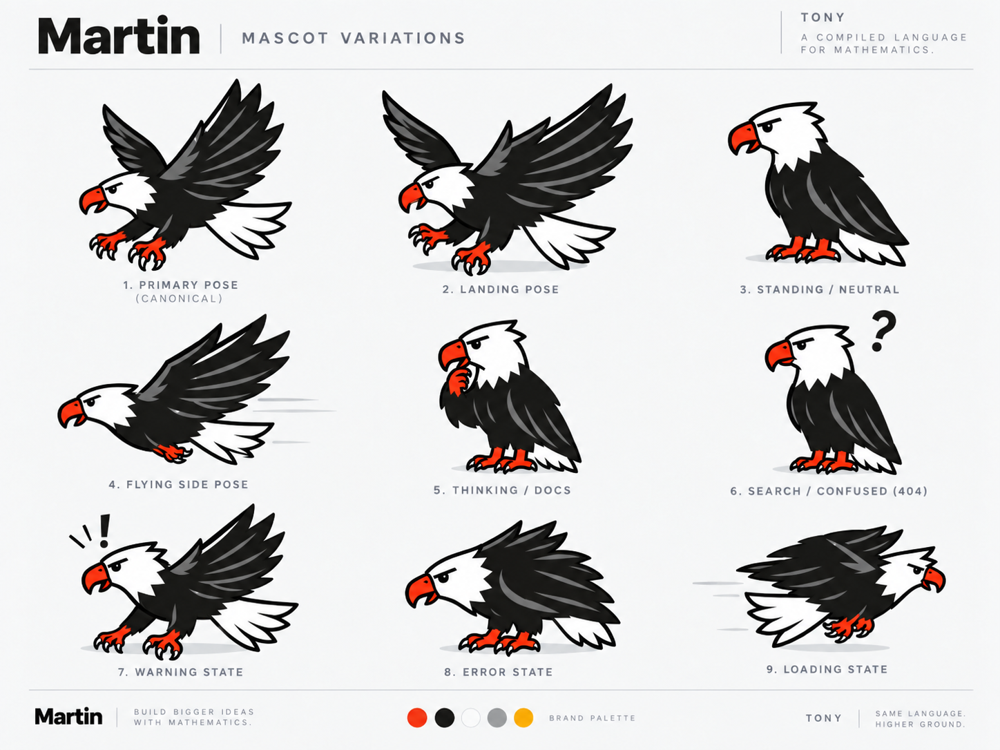

# Tony

Tony is Martin's mascot, a bald eagle, named after the author's father
([why Martin?](why-martin.md)). He is the friendly giant: relaxed, mildly
amused, and competent to an almost ridiculous degree. When something
computationally horrifying happens, Tony is not sweating; he is just
carrying it away. The artwork is in [assets/tony](assets/tony).

| file | use |
|---|---|
| `src-logo.png` | the logo on a white background (1254 x 1254) |
| `tony-logo.png` | the logo with a transparent background (1000 x 900) |
| `tony-primary.png` | primary pose (canonical) |
| `tony-landing.png` | landing |
| `tony-standing.png` | standing, neutral |
| `tony-flying.png` | flying, side view |
| `tony-thinking.png` | thinking; for documentation |
| `tony-confused.png` | confused; for "not found" and search pages |
| `tony-warning.png` | warning |
| `tony-error.png` | error |
| `tony-loading.png` | loading |
| `tony-head.png` | head only, for small sizes |
| `src-sheet.png` | the sheet of all variations, with the brand palette |

The README banner (`assets/banner.png`) is built from `src-logo.png`; its
source and rendering command are in [assets/banner](assets/banner).

The pose images are small (190 to 420 pixels on a side). All the `tony-*.png`
files have transparent backgrounds, and the white head and tail are
transparent too, so on a dark background the eagle loses its head. For pages
that may be shown in a dark theme (GitHub's included), use the copies in
[assets/tony/on-white](assets/tony/on-white), composited onto white.

## Where each pose goes

| situation | pose |
|---|---|
| a successful compile, or the compiler collapsing a large model | `tony-flying.png` or `tony-primary.png`, carrying it off |
| a long run (sampling) | `tony-loading.png` |
| documentation | `tony-thinking.png` |
| a page or name not found | `tony-confused.png` |
| a warning | `tony-warning.png` |
| a compile error | `tony-error.png`, looking at your code like "what did you do?" |
