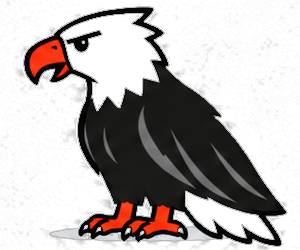

# Why Martin?

Martin is named after my father.

He was a very big man, the kind of person family stories inevitably turn into
legends about. He once lifted the back of a car and moved it. He could form
hamburger patties with his hands. He rode motorcycles, smoked cigarettes, and
looked considerably more intimidating than the person his family actually
knew.

To us, he was funny, warm, and extraordinarily dependable.

When I was in college, he would drive an hour and a half to pick me up so I
could keep working at my job back home, then make the trip again to take me
back. He did things like that constantly. You usually saw the easygoing
person in front of you, not the enormous amount of effort happening behind
the scenes.

That idea became part of Martin's philosophy.

Martin is meant to make difficult mathematics feel almost unfairly simple. A
Bayesian model that might take hundreds of lines of infrastructure should
take a handful. Inference, and, in time, optimisation and differential
equations, should describe what you want, not every mechanical detail
required to compute it.

Behind that simple interface, the compiler does the hard part. It reads the
mathematical structure of your program, the shapes, the constraints, which
quantities are data and which are unknown, and uses it to remove work that
is not needed, choose how the data is laid out in memory, derive the
gradients, and, where the structure allows, integrate parts of the model out
so the sampler has less to do (today, Gaussian random walks). Where it is going is further down the same
road: recognising conjugate structure, exploiting sparsity, integrating out
non-Gaussian latent variables, and choosing the inference strategy for the
model in front of it, so that a model with tens of thousands of parameters
behaves like one with a few hundred (see the [roadmap](roadmap.md)).

The goal is simple:

**You describe the problem. Martin handles the weight.**

## And Tony?

Tony was my dad's name.

So Tony became Martin's eagle.

He's friendly because my dad was friendly. He's enormous because my dad was
enormous. And when Martin meets some gigantic computational problem, Tony's
attitude is the same one my dad had when something heavy needed moving:

**Alright. Give it here.**
